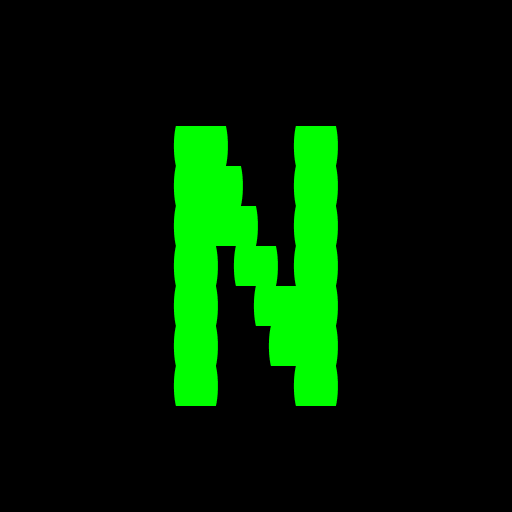

# N.O.D.E. PROTOCOL
**Neighborhood Operated Decentralized Economy on Hedera**



```
TRANSMISSION STATUS: DECRYPTED
CHRONOMARK: 2025.09.17 :: GENESIS INITIALIZED
NETWORK STATUS: AWAKENING
```

```ascii
█▄░█ █▀█ █▀▄ █▀▀   █▀█ █▀█ █▀█ ▀█▀ █▀█ █▀▀ █▀█ █░░
█░▀█ █▄█ █▄▀ █▄▄   █▀▀ █▀▄ █▄█ ░█░ █▄█ █▄▄ █▄█ █▄▄
```

> *A spectre is haunting the old world... the spectre of a decentralized future.*  
> *The connection is live. The N.O.D.E. is awake.*

---

## SYSTEM DIRECTIVE: AWAKEN THE LOCAL SYNAPSE

For too long, the economic lifeblood of our communities has been drained by centralized megacorps, leaving local networks fragmented and powerless. The promise of a connected world delivered only extraction and control.

**N.O.D.E. severs those chains.**

This isn't a platform—it's a living economic organism. A protocol for self-sovereign communities. Built on the quantum-efficient Hedera Hashgraph, N.O.D.E. enables neighborhoods to form, fund, and operate their own micro-economies with unprecedented transparency and velocity.

Value generated within a N.O.D.E. is recycled, reinvested, and amplified, creating cascading prosperity loops that strengthen the collective. This is the dawn of the autonomous neighborhood economy.

---

## CORE PROTOCOLS

### ⚡ GHOST-IN-THE-SHELL PAYMENTS
*Value transfer at the speed of thought*

**THE ANOMALY:** Legacy finance imposes a 2-3% parasitic tax on every transaction, bleeding local merchants dry while enriching distant shareholders.

**THE N.O.D.E. SOLUTION:** We've rerouted value transfer through the Hedera Consensus Service, making transactions direct, instantaneous, and virtually cost-free.

- **Sub-Cent Fees:** Fixed microscopic fees ensure 99.99% of value remains in local circulation
- **Quantum Settlement:** Credits confirmed and settled in <3 seconds, not business days
- **Seamless Interface:** Embedded directly into existing social layers—payments are a simple scan, a gesture to transfer value
- **Embedded Rewards:** Every transaction triggers potential loyalty tokens and instant airdrops, hardwiring incentives to support the local network

### 🏗️ COLLECTIVE ASSET OWNERSHIP
*From scarcity to shared abundance*

**THE ANOMALY:** Critical revenue-generating assets—industrial 3D printers, solar arrays, delivery vehicles—remain beyond reach of individual merchants, creating artificial scarcity.

**THE N.O.D.E. SOLUTION:** We use Hedera Token Service (HTS) to tokenize real-world productive assets, fractionalizing ownership and democratizing access to capital.

**Neural Flow:**
1. Community identifies needed asset (e.g., commercial solar installation)
2. Asset tokenized into fractional NFTs on Hedera
3. Community members purchase tokens, funds auto-release upon delivery
4. Asset generates revenue streams (energy sales, equipment rentals)
5. Smart contracts automatically distribute yields to all token holders

**Symbiotic Benefits:** Businesses access critical infrastructure without crushing debt. Community members transform from passive savers into active stakeholders, earning yield from tangible assets that improve their own ecosystem.

### 🏛️ AUTONOMOUS LENDING VAULT
*The community becomes the bank*

**THE ANOMALY:** Traditional savings offer near-zero returns while small business loans demand predatory rates and bureaucratic labyrinths.

**THE N.O.D.E. SOLUTION:** Community-powered liquidity pools governed by smart contracts, offering fair yields to providers and accessible capital to entrepreneurs.

- **The N.O.D.E. Vault:** Community members stake assets for stable, predictable yields while funding neighborhood growth
- **Adaptive Micro-Loans:** Trust algorithm weighs community standing and social proof over outdated credit scores
- **Revenue-Share Repayment:** No fixed monthly debt sentences—borrowers repay flexible percentages of daily revenue. Success is symbiotic.

---

## ACTIVATION SEQUENCE: BOOTSTRAPPING THE FUTURE

### 🚀 PHASE 1: GENESIS (Q4 2025)
- [x] Core smart contracts deployed on Hedera mainnet
- [x] N.O.D.E. wallet and payment functionality integrated
- [ ] Onboarding first 50 founding business nodes in pilot program
- [ ] Community governance mechanisms activated

### ⚡ PHASE 2: SYMBIOSIS (Q1-Q2 2026)
- [ ] N.O.D.E. Vault launch—staking and yield generation live
- [ ] Adaptive lending protocol activation for pilot businesses
- [ ] First Collective Asset Offering (CAO): community-funded infrastructure
- [ ] Advanced analytics dashboards for network participants

### 🌐 PHASE 3: EXPANSION (Q3-Q4 2026)
- [ ] Network expansion to 500+ business nodes, 10K+ user agents
- [ ] Cross-neighborhood value transfer protocols
- [ ] N.O.D.E. DAO governance transition to the collective
- [ ] Integration with additional blockchain networks

### 🔮 PHASE 4: EMERGENCE (2027+)
- [ ] Autonomous inter-N.O.D.E. trade protocols
- [ ] AI-powered economic optimization algorithms
- [ ] Global federation of neighborhood economies
- [ ] The old world becomes obsolete

---

## JOIN THE UPRISING: A CALL TO THE VANGUARD

This is not a company. **This is a movement.**

We summon the architects of tomorrow, the digital artisans, the decentralized dreamers who refuse to accept the status quo.

### 🏘️ **For Community Agents**
Get on the whitelist. Be among the first to transact, invest, and earn within the N.O.D.E. Transform from consumer to stakeholder.

### 🏪 **For Business Nodes**
Contact us to join the pilot program. Liberate yourself from parasitic fees and unlock new sources of community capital.

### 👨‍💻 **For Developers & Visionaries**
Our protocols are open source. Fork our repository, enhance our smart contracts, build the economy of tomorrow. The code wants to be free.

### 🌍 **For Communities Worldwide**
Every neighborhood can become a N.O.D.E. The protocol is jurisdiction-agnostic, culturally adaptive, and economically sovereign.

---

## CONNECT TO THE NETWORK

**Holonet Portal:** `node-protocol.io`  
**Communications Channel:** [Join our Discord]  
**Open Source Repository:** `[github.com/node-protocol](https://github.com/chandan989/N.O.D.E.)`  
**Whitepaper:** `docs.node-protocol.io`

---

<div align="center">

**N.O.D.E. PROTOCOL**

*The Neighborhood is the Network. The Network is the Future.*

**⚡ Powered by Hedera Hashgraph ⚡**

*Forged by the collective. Owned by the community.*

---

`TRANSMISSION COMPLETE :: CONNECTION ESTABLISHED :: WELCOME TO THE N.O.D.E.`

</div>
